# Python BattleShips Game
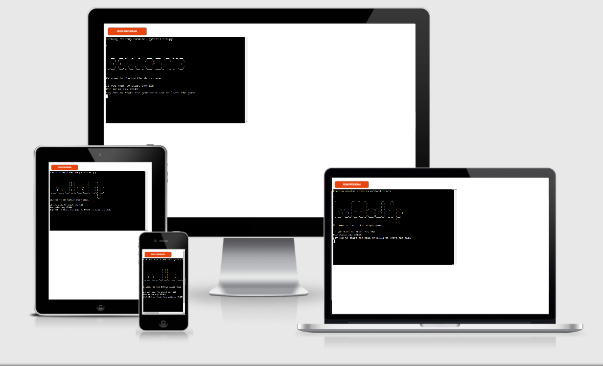

[BattleShips](https://pp3-battleships-game.herokuapp.com/) game live link.

[Repository](https://github.com/NowickiLukasz/pp3_battleships) link. 

## How to play game

This version of the BATTLESHIPS game consists of 2 players. The user and the PC.
There are 2 boards that are created. The user board shows the users ships at all times. The PC board is shown with empty rows and columns in which the user has to find the hidden ships.

## The game layout

A hit ship is marked as an "X"
A miss is marked as an "-"
Ship placement is marked with an "@"

The user and PC respectively take turns to find the hidden ships on eachothers boards.
The winner of the game is the person who finds all of the opponents ships.

## User Stories

Python based game where User tries to beat the PC in a game of battleships

- Display game welcome page
- Ask player to play or look at the rules
- User board displayed pre-populated with ships
- Pc board displayed with hidden ships
- Ask user for row guess
- Valid input allowed
- Ask user for column guess
- Valid input allowed
- User input checked againt PC board
- PC guess checked against the player board
- Display message if a ship was hit or missed
- Mark on boards hit or miss
- Diplay how many rounds remain
- Ask if player want to continue
- Validate next round decision
- If player wants to end the game prints PC board and ends the game
- If player continues, player board and pc board are printed with updated hit or miss marks
- If user hits all ships display message and end game
- If pc hits all ships display message and end game
- If all the round used up. End game and print PC and user boards

## Features

- Randomly generated ships on the player board
- Randomly generated ships on PC board which are hidden from the player
- Accepts input from user to allow for row and column position
- Round counter
- Score counter
- Computer random guess function

## Game Logic

The game begins with the user being welcomed and and asked do they wish to start the game or would they like to read the rules.
If the user knows how to play the game, they may type "START" and this will take them to the game boards or if the user wants to read the rules they may type "RULES".

Once the user is happy to continue with the game, 2 game boards of 8*8 size are presented. One that belongs to the user. This board is populated with ships ie. "@". 
The other board belongs to the PC and it shows a black board with hidden ships.

The user is asked to enter the column value, followed by the row value and the PC randomly selects the values to play.

The user input is then compared to the value of the PC board to see if there a ship hidden in that location. If a ship is present. A marker on the player guess board will be shown with an "X" if the location has no ship a "-" will be marked.

The same process happens for the PC choice but it is marked on the player board instead.

Each round is decreased from 20 rounds to 0. If this happens the game ends, if the player or PC have found all of the opponent ships, a message is showns who won the game. 

## Future features

- Larger Ship sizes
- Ship orientation
- independent user ship input
- Change board size

## Testing

Manual testing was performed on the project through the following:

- Code passed the PEP8 validator withour major problems
- Tested in the python terminal and through Heroku Terminal

When the game loads, the user is greeted and asked if the want to start the game or read the rules

    
Welcome Screen

    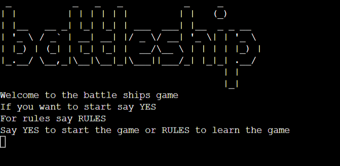

    
Main Menu Input Validation

    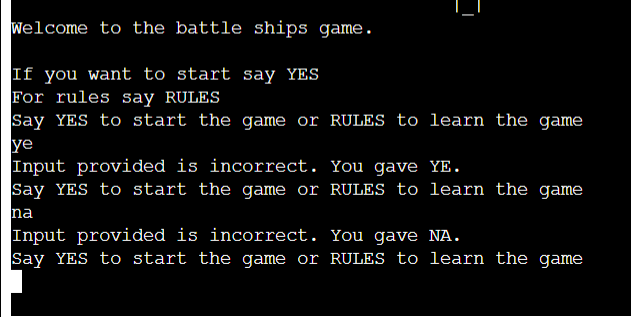

When the user selects start, the input is verified to match the requirements, if no match found an error will print and a request to enter an option is prompted again.
The game then is started and player and PC boards are printed.

    
Start Game Boards

    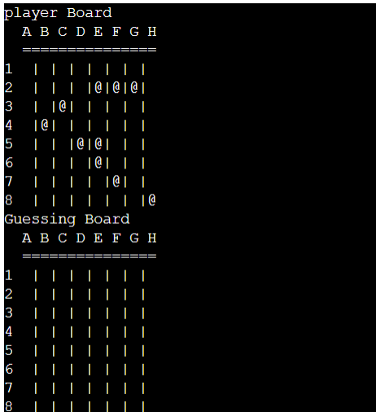

When the user selects RULES, the input is verified to match the requirements. A rules menu is presented and an option to start the game is shown.
Once START is selected game begins

- User board is printed with shown ships
- PC board is printed with hidden ships

    
Rules Menu

    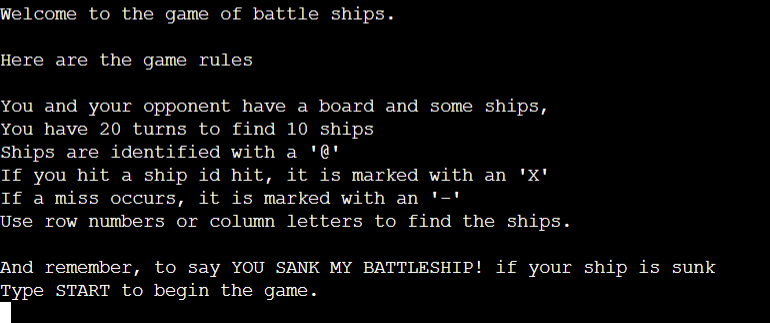

    
Rules Validation

    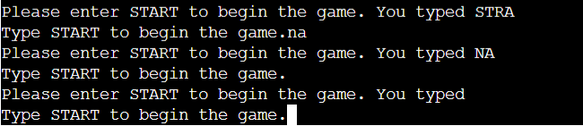

The user is asked to provide input for a row and a column.
Rows are numbers from 1-8.
Columns are letters from A-H
The input then is validated to make sure only the afore mentioned parameters are allowed.
If there is an error, the user will be promped with their input and then to enter a correct value.

    
Row Input

    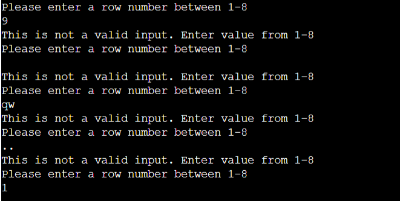

    
Column Validation

    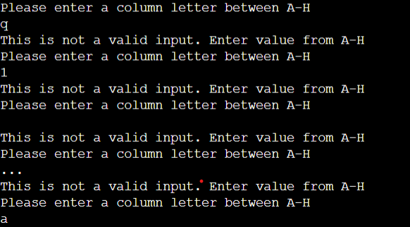

When the user completes the input, the input is compared to a cell on the pc_board to identify if there is a ship present or no ship. A message is then printed if the user has hit or missed a ship.
The player_guess_board then is updated to show an "X" if hit, or "-" if miss.
If the player_guess_board contains an "X" or "-" then the user is prompted to try again.
PC makes a random choice of row and column and checks weather there is a ship present on the player_board. If there is a ship present, player_board is marked with an "X" on a "-" if a miss.
If a ship is hit by either the PC or user, score is incremented and printed.
Turns are decreased each round.
An option then is given to the user to continue or to quit.

    
Updated boards with markers

    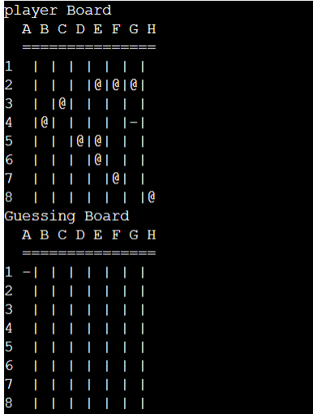

- Check user input against pc_board ship placement
- Message printed if hit or miss
- Mark placed on the input cell to show that a ship has been miss or hit
- PC checks against player_board ship placement
- Mark placed on the cell to show that a ship has been miss or hit
- Pc and user ships found score incremented and printed
- Game turns are decreased each round
- User is asked to continue the game or to quit

The user input is validated to only allow "YES" or "NO" input. If anything else is entered user is prompted with a warning message and a request to repeat the input.

    
Manual end of round

    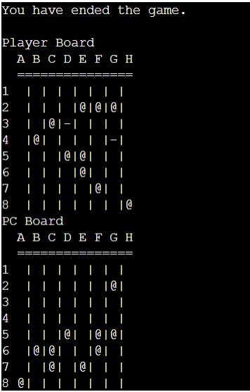

    
Next Round Validation

    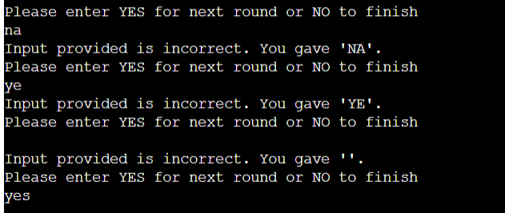

The game runs for 20 rounds. Once the rounds reach 0 the game is over

    
All Moves Taken Up

    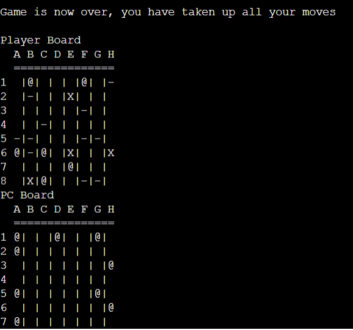

The game has 10 ships placed. Once all ships are found, a message is displayed on who won.

    
All Ships Found PC Win

    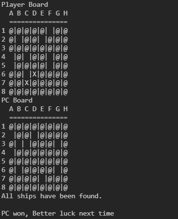

    
All Ships Found User Win

    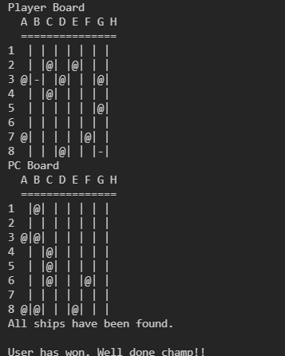

For testing purpouses, the PC has been give a choice of 55 ships to chose from, and only needed to hit "2" ships.
During player_guess_board testing, a PC Board was populated and printed to show all of the ships. The ship locations were then manualy inserted and each was sank.

Code required to do so needs to be placed in:

`def print_playing_boards()` and `def print_start_of_game()`

The following code displays the PC Board with ships, and should be placed within the methods above for testing purposes.

`print_game_board(pc_board)`

Validator Testing

    
PEP8 Validations

    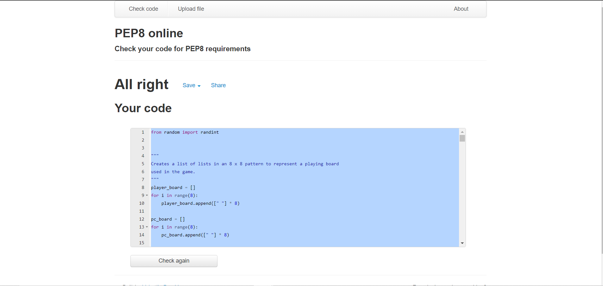

## Technologies Used

- Python3
- GitHub
- GitPod
- Heroku
- ASCII art

## Deployment

This site was deployed to Heroku by following the below steps:

- On [Heroku.com](), create a new app
- Under the settings tab, set the build packs to
    - heroku/python
    - heroku/nodejs
- Link the app to the [GitHub Repository](https://github.com/NowickiLukasz/pp3_battleships)
- Enable automatic Deploys and click Deploy
- Link to deployed website - [Battleships](https://pp3-battleships-game.herokuapp.com/)

## Credits

Initial Code inspired by [Knowledge Mavens](https://www.youtube.com/watch?v=tF1WRCrd_HQ&ab_channel=KnowledgeMavens) video on how to create the logic for the game.

Code to convert from letters to numbers taken from [HERE](https://github.com/dmoisset/battleship-dojo)

[ASCII Art](https://ascii.co.uk/art/battleship) used in the welcome page of the game.